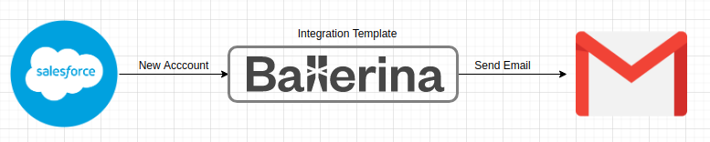
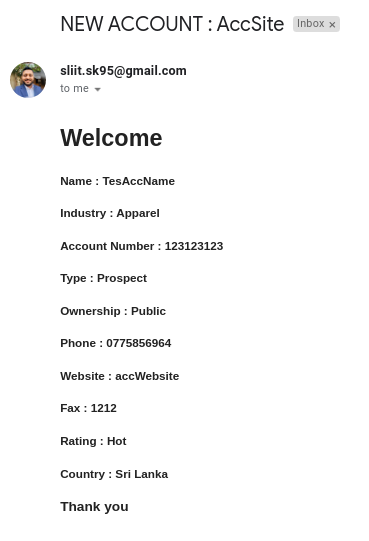

# Salesforce to Gmail - Send Gmail email alerts for new Salesforce Accounts

## Integration Use Case 

This integration template listens to the created Salesforce Accounts and Send them Gmail alerts.



## Prerequisites

- [Ballerina Distribution](https://ballerina.io/learn/getting-started/)
- A Text Editor or an IDE ([VSCode](https://marketplace.visualstudio.com/items?itemName=ballerina.ballerina), 
[IntelliJ IDEA](https://plugins.jetbrains.com/plugin/9520-ballerina)).  
- [Salesforce Connector](https://github.com/ballerina-platform/module-ballerinax-sfdc) will be downloaded from 
[Ballerina Central](https://central.ballerina.io/) when running the Ballerina file.

#### Setup Salesforce Configurations
Create a Salesforce account and create a connected app by visiting [Salesforce](https://www.salesforce.com). 

Salesforce username, password and the security token that will be needed for initializing the listener. 

For more information on the secret token, please visit [Reset Your Security Token](https://help.salesforce.com/articleView?id=user_security_token.htm&type=5).

#### Create Push Topic in Salesforce developer console

The Salesforce trigger requires topics to be created for each event. We need to configure topic to listen on Custom Object entity.

1. From the Salesforce UI, select developer console. Go to debug > Open Execute Anonymous Window. 
2. Paste following apex code to create topic and execute.
```apex
PushTopic pushTopic = new PushTopic();
pushTopic.Name = 'NewAccountInsert';
pushTopic.Query = 'SELECT Id, Name, AccountNumber, Site, Phone, Fax, Website, Type, Industry, Ownership, Rating, ShippingAddress  FROM Account';
pushTopic.ApiVersion = 48.0; 
pushTopic.NotifyForOperationUpdate = true;
pushTopic.NotifyForFields = 'Referenced';
insert pushTopic;
```
3. Once the creation is done, specify the topic name in the event listener service config.

#### Setup Gmail Configurations
Create a Google account and create a connected app by visiting [Google cloud platform APIs and Services](https://console.cloud.google.com/apis/dashboard). 

1. Click Library from the left side menu.
2. In the search bar enter Gmail.
3. Then select Gmail API  and click Enable button.
4. Complete OAuth Consent Screen setup.
5. Click Credential tab from left side bar. In the displaying window click Create Credentials button
Select OAuth client Id.
6. Fill the required field. Add https://developers.google.com/oauthplayground to the Redirect URI field.
7. Get clientId and secret. Put it on the config(ballerina.conf) file.
8. Visit https://developers.google.com/oauthplayground/ 
    Go to settings (Top right corner) -> Tick 'Use your own OAuth credentials' and insert Oauth ClientId and secret.Click close.
9. Then,Complete Step1 (Select and Authotrize API's)
10. Select the required Gmail API scopes from the list of API's, and then click Authorize APIs.
Make sure you select https://mail.google.com/ (full privilage) or https://www.googleapis.com/auth/gmail.send(Specific privilage only)
11. Click Authorize API's and You will be in Step 2.
12. Exchange Auth code for tokens.
13. Copy Access token and Refresh token. Put it on the config(ballerina.conf) file.

## Configuring the Integration Template

1. Once you obtained all configurations, Create `ballerina.conf` in root directory.
2. Replace "" in the `ballerina.conf` file with your data.

##### ballerina.conf

```

SF_USERNAME=""
SF_PASSWORD=""
SF_BROADCAST_TOPIC=""

G_ACCESS_TOKEN = ""
G_CLIENT_ID = ""
G_CLIENT_SECRET = ""
G_REFRESH_TOKEN = ""
G_REFRESH_URL = ""

G_SENDER_EMAIL = ""
G_CC_EMAIL = ""
G_RECEIVER_EMAIL = ""

```

## Running the Template

1. First you need to build the integration template and create the executable binary. Run the following command from the root directory of the integration template. 
`$ ballerina build`. 

2. Then you can run the integration binary with the following command. 
`$ ballerina run target/bin/sfdc_new_lead_to_gmail.jar`. 

Successful listener startup will print following in the console.
```
>>>>
[2020-09-25 11:10:55.552] Success:[/meta/handshake]
{ext={replay=true, payload.format=true}, minimumVersion=1.0, clientId=1mc1owacqlmod21gwe8arhpxaxxm, supportedConnectionTypes=[Ljava.lang.Object;@21a089fc, channel=/meta/handshake, id=1, version=1.0, successful=true}
<<<<
>>>>
[2020-09-25 11:10:55.629] Success:[/meta/connect]
{clientId=1mc1owacqlmod21gwe8arhpxaxxm, advice={reconnect=retry, interval=0, timeout=110000}, channel=/meta/connect, id=2, successful=true}
<<<<
```

3. Now you can add new leads in Salesforce and observe that integration template runtime has received the event notification for the broadcasted Leads.

4.  You can check the Gmail to verify that the received email. 

#### Sample Email format

This is the sample format of the email that you will receive.



#### Sample logs

```
>>>>
time = 2021-02-05 12:16:21,469 level = INFO  module = nuwant/sfdc_new_acoount_to_gmail message = "New Account : {"event":{"createdDate":"2021-02-05T06:46:20.483Z","replayId":4,"type":"created"},"sobject":{"Site":"AccSite","Industry":"Apparel","Ownership":"Public","Type":"Prospect","Phone":"XXXXXXXX","ShippingAddress":{"ShippingLatitude":null,"ShippingPostalCode":"10250","ShippingCountry":"Sri Lanka","ShippingCity":"Nugegoda","ShippingState":"western","ShippingGeocodeAccuracy":null,"ShippingLongitude":null,"ShippingStreet":"XXXXX"},"Rating":null,"Website":"accWebsite","Id":"0015g000003OIQnAAO","Fax":"1212","AccountNumber":"123123123","Name":"TesAccName"}}" 
<<<<
```
